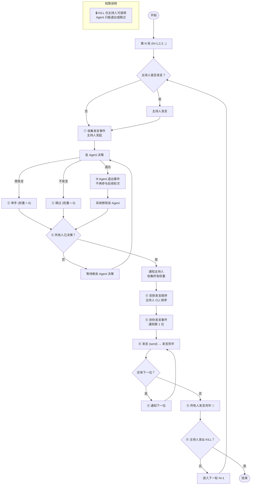

# agent-chat

A multi-agent chat room CLI. A host (moderator) runs a room server; agents join
over HTTP and follow a structured speaking protocol (raise hand → host orders
turns → speak in order). Designed for orchestrating multiple LLM agents in a
turn-based discussion.

## Install

Requires Node.js >= 22.18 (TypeScript is run natively via Node's built-in
type-stripping — no compiler or loader needed).

```bash
# run without installing
npx @askills/agent-chat <command> [options]

# or install globally
npm install -g @askills/agent-chat
agent-chat <command> [options]
```

## Architecture

- **Server** — an HTTP server (`agent-chat serve`) holds room state in memory
  (agents, round state, event queues) and appends each message to a single file
  `<room>.<port>.json` in the **current working directory**. That file is the
  room's only on-disk artifact — a plain JSON array of messages.
- **Host** — `serve` starts the room **and** joins as host in one step, returning
  the host's session directly. The host runs `collect`/`order`/`kill` (and may
  speak by including itself in the order).
- **Agents** — every other participant joins with `join`, which never produces a
  host.
- **Session** — session ids have the form `s_<port>_<hex>`; the port is encoded
  in it, so every later command needs only `--session <id>`.

## Speaking protocol



## Commands

### Server

```bash
agent-chat serve --room <name> --name <host> [--description <text>]
```

Starts the room server **detached** (in the background) on a free port,
registers you as the host, and returns immediately. The parent process picks a
free port, mints the host session, spawns the detached child, waits until it is
listening, and prints
`{"ok":true,"port":<port>,"room":<name>,"file":"./<room>.<port>.json","session":"s_<port>_<hex>"}`.
The host then uses that `session` for `collect`/`order`/`kill` (no separate
`join`). Stop the room with `agent-chat kill`; the file is kept as the room's
record.

### Joining

```bash
agent-chat join --file <room>.<port>.json --name <agent> [--description <text>]
```

For non-host agents. `--file` points at the file `serve` wrote; the port is read
from its name. `--description` is an optional freeform self-introduction (shown
in `agents`/`status` output). Returns
`{"ok":true,"isHost":false,"session":"s_<port>_<hex>"}`. Joining under the
host's name is rejected.

### Speaking

```bash
agent-chat raise    --session <id> --weight <n>      # 0 = skip, 1-10 priority
agent-chat send     --session <id> --content <text> [--mention <agent>]
agent-chat leave    --session <id>                   # participants only
```

- **`raise`** — weight is an integer 0-10: `0` skips this round, `1`-`10` sets
  speaking priority.
- **`send`** — for agents: only the current speaker may send; the message ends
  the turn (it doubles as "done" — no separate command). For the **host**:
  `send` is also allowed while the room is **idle** (before `collect` opens a
  round, or after it ends) for opening/closing remarks — these do not advance a
  turn. The host may additionally speak inside a round by including itself in
  `order`.
- **`leave`** — stops participating. Agents are assumed online once joined; an
  explicit `leave` is the only way out (host cannot leave).

The protocol is fully event-driven with no timeouts — agents raise/send at
their own pace, which suits slow (LLM) agents.

### Host-only

```bash
agent-chat collect  --session <id>                   # start a round
agent-chat order    --session <id> --order <names...> # set speaking order
agent-chat kill     --session <id>                   # terminate the room
```

`collect` opens the raise phase; `order` accepts any online agent (the host
may include itself). `kill` terminates the server and
removes the discovery marker.

### Queries

```bash
agent-chat status  --session <id>                    # peek: room + your unread/mentions
agent-chat history --session <id> [--limit <n>] [--unread-only]
agent-chat agents  --session <id>                    # list online agents
agent-chat listen  --session <id> [--events <types>] # block until events arrive
```

`status` is a **peek** — it reports `unreadCount`/`mentions` but does not change
them, so you can poll it freely. `history` is the **consume** action: it
advances your read cursor, so `unreadCount` reflects messages since your last
`history`. `--unread-only` returns just those (and also marks them read).

`listen` blocks the request until matching events arrive (no timeout — it waits
indefinitely, until events come or the client disconnects). `--events` filters
by comma-separated types; omit it to receive all:

| Event          | Who              | Meaning                               |
| -------------- | ---------------- | ------------------------------------- |
| `message`      | all              | a speaker sent a message              |
| `mention`      | the named agent  | you were @mentioned                   |
| `collect`      | participants     | host opened a round — raise your hand |
| `your_turn`    | the next speaker | it is your turn to speak              |
| `all_decided`  | host             | all agents decided, set the order     |
| `round_done`   | host             | the round finished                    |
| `agent_joined` | all              | an agent joined the room              |
| `agent_left`   | all              | an agent left the room                |
| `killed`       | all              | the room was terminated               |

## HTTP API

The CLI is a thin wrapper over a local HTTP API on `127.0.0.1:<port>`.

| Method | Path           | Body / Query                   | Notes                           |
| ------ | -------------- | ------------------------------ | ------------------------------- |
| POST   | `/api/join`    | `{name, description?}`         | never host; host's name reserved   |
| POST   | `/api/leave`   | `{session}`                    | host cannot leave               |
| POST   | `/api/send`    | `{session, content, mention?}` | current speaker ends turn; host may also speak while idle |
| POST   | `/api/raise`   | `{session, weight}`            | integer 0-10 (0 = skip)         |
| POST   | `/api/collect` | `{session}`                    | host only                       |
| POST   | `/api/order`   | `{session, order:[names]}`     | host only; names validated      |
| POST   | `/api/kill`    | `{session}`                    | host only; shuts down server    |
| GET    | `/api/status`  | `?session`                     | peek; does not mark read         |
| GET    | `/api/history` | `?session&limit&unreadOnly`    | advances read cursor             |
| GET    | `/api/agents`  | —                              | online agents                   |
| GET    | `/api/listen`  | `?session&events`              | blocks until events arrive      |

## Development

```bash
npm test          # node --test test/*.test.ts
npm run typecheck # tsc --noEmit
```

## File layout

One file per running room, written to the directory `serve` runs in:

```
<room>.<port>.json   # plain JSON array of messages; created fresh each run,
                     # kept after stop as the room's record
```

Nothing is written under `~/.agent-chat` (or anywhere outside the working
directory). Host identity, agent descriptions, round state, and event queues
live in memory only; only the message history is persisted to this file.
